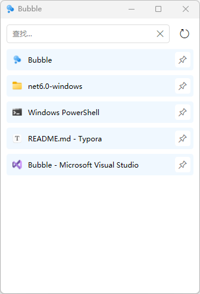
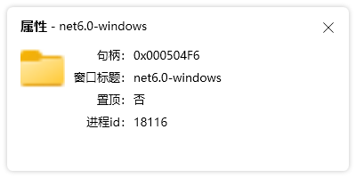

# Bubble
> dev分支，WinUI3版本开发中

窗口置顶工具（Set window topmost tool）

`WPF` `.Net6` `MVVM`

> 软件功能

1. 窗口置顶/取消置顶
2. 查看窗口属性
3. 重置窗口位置
4. 重置窗口尺寸

> 软件下载

软件有依赖框架版本和独立版本，依赖框架版本为一个exe文件，下载后直接运行，需要电脑有.Net6环境，支持win10和win11。独立版本为一个zip文件自带.Net6环境，解压后运行Bubble.exe文件，支持win7、win10和win11。

[依赖框架版下载](https://github.com/zou-z/Bubble/releases/download/1.0.0.0/Bubble_v1.0.0.0.exe)

[独立版下载](https://github.com/zou-z/Bubble/releases/download/1.0.0.0/Bubble.Independent_v1.0.0.0.zip)

> 软件截图

1.主界面

2.查看窗口属性

